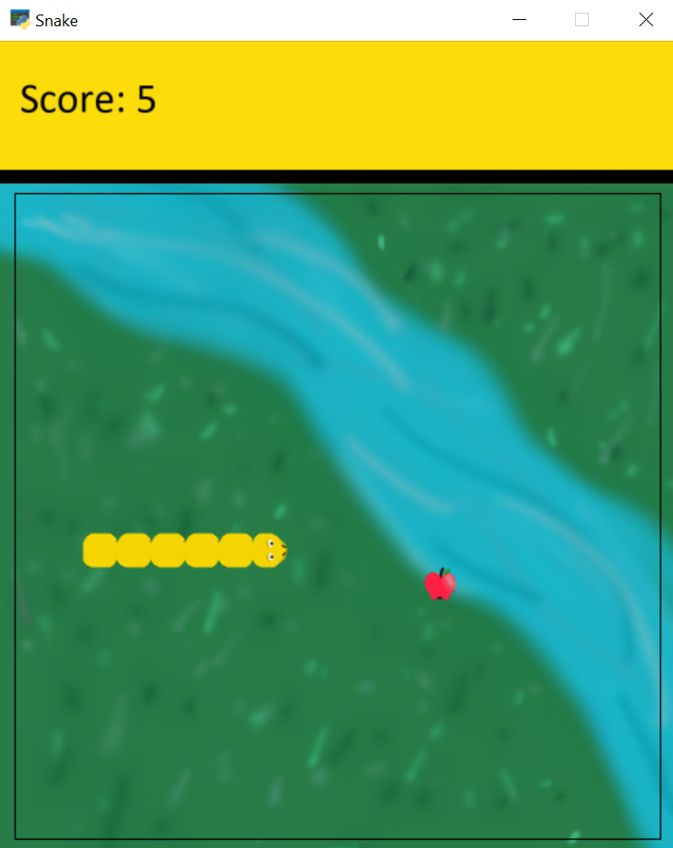
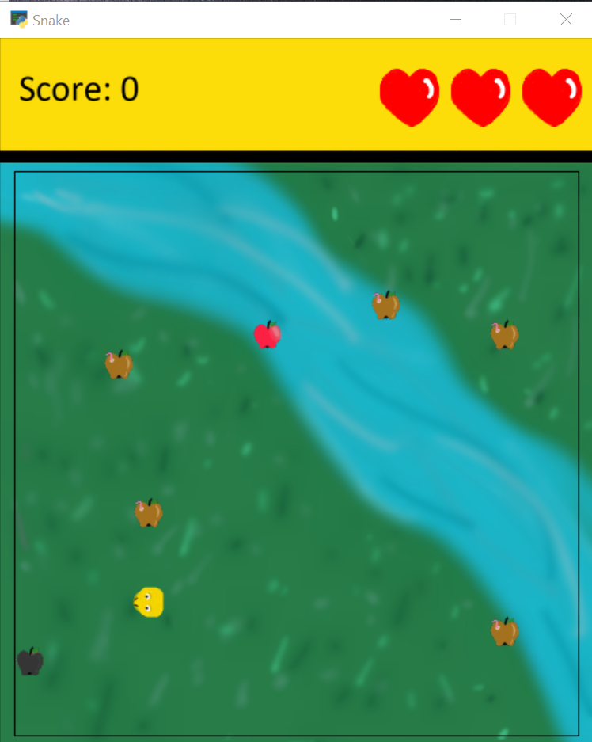
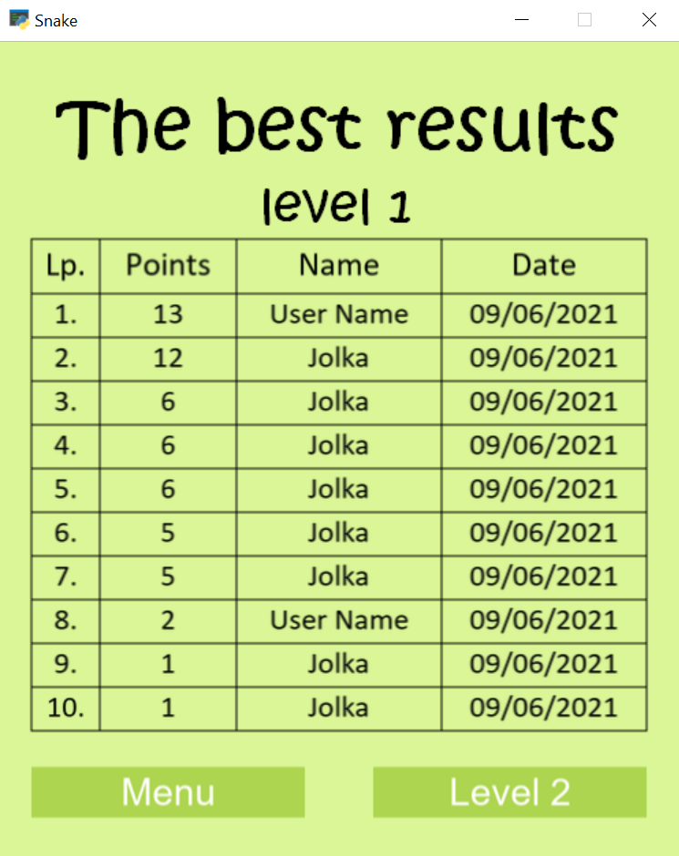

# Snake
## Author: Urszula Spik

### Short description
Arcad game Snake with two difficulty levels
* level 1 - classic
* level 2 - version with lives, additional black and brown apples which take lives.

The game features a start screen with a menu where you can find information about the author, rules of the game, exit button, player statistics, and a place to enter a username.
After the game is over, the player is redirected to the end screen.

### Technologies
**Python** - Python language, version 3.8.5

**arcade** - Python library to make arcade games.

**pandas** - Python library to work with data files.

### How to run this app?
1. Clone the template project
`git clone  https://github.com/urszulaspik/Gra-arkadowa.git snake-game`
`cd snake-game `
2. Create virtual enviroment
3. Install the project's development and runtime requirements:
`pip install -r requirements.txt`
4. Go to folder with game  `cd game`
5. Type in cmd `python snake_game.py`

### Example image

