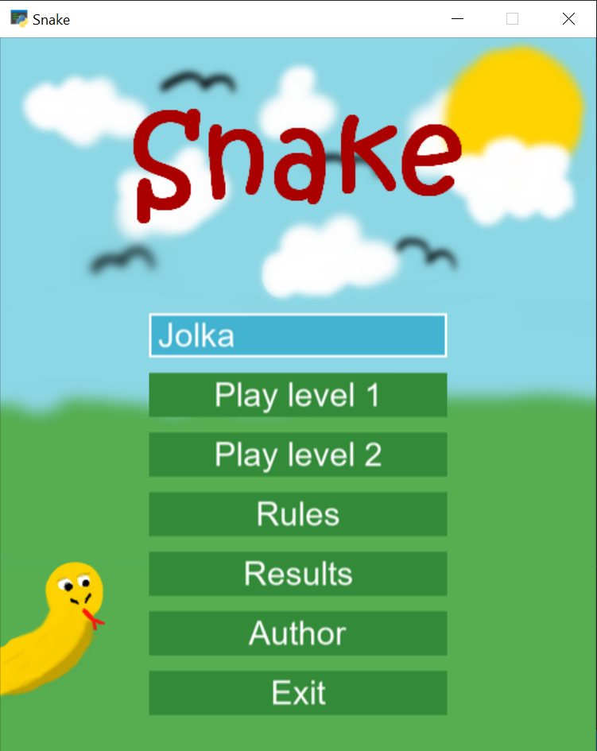

# Snake
## Author: Urszula Spik

### Short description
Arcad game Snake with two difficulty levels
* level 1 - classic
* level 2 - version with lives, black and brown apples that take life have been added.

The game features a start screen with a menu where you can find information about the author, rules of the game, exit button, player statistics, and a place to enter a username.
After the game is over, the player is redirected to the end screen where can play again, back to menu or exit game. During the game, the user should use the arrows on the keyboard to move the snake.

### Technologies
**Python** - Python language, version 3.8.5

**Python Arcade Library** - Python library to make arcade games.

**Python Pandas Library** - Python library to work with data files, used to create best results section.

**FireAlpaca** - to create all the graphics used in the game.

### How to run this app?
1. Clone the template project:

    `git clone  https://github.com/urszulaspik/Gra-arkadowa.git snake-game`

    `cd snake-game `
2. Create virtual enviroment
3. Install the project's development and runtime requirements:

    `pip install -r requirements.txt`
4. Run the game:

    `python mysnake.py`

### Example image from game

